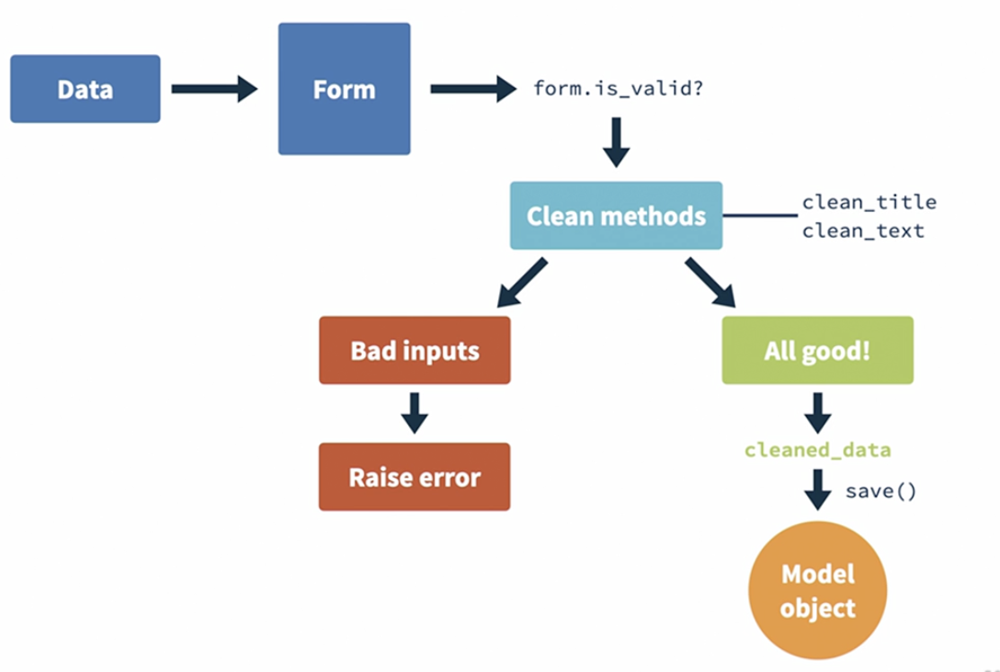

# SmartNotes-Django

# Django Tutorial

## **Getting started with Django**

Start a Django Project

```python
django-admin startproject project_name
```

the above command will create a manage.py file and a folder with the name project_name.

The manage.py will the entry point to the project, and the important files in the folder are _‘urls.py’_ and _‘settings.py’_. The urls.py will the file where we will be defining the different routes and urls of the project.

In order to run the project we need to run the below command

```python
python manage.py runserver
```

running the above command will start the server and will open the default website on the localhost with 8000 port.

We make use of Apps in order to containerize the entire project into multiple Apps so that ther is no conflict or mess between the different Apps.

```python
django-admin startapp app_name
```

Once a new app is created we need to add this app to the settings file, under the _‘INSTALLED_APPS’_.

Django uses a common framework called as MVT - (Model, View, Template). Views are responsible for handling requests and responses. Model layer handles the data and how it is stored. Template layer helps render the information coming from the model into HTML pages.

## **Created First App - Home app**

Once a new app is created, we can go inside the views file and create function such as

```python
from django.shortcuts import render
from django.http import HttpResponse

# Create your views here.
def home(request):
    return HttpResponse("Hello World!!")
```

Once this is ready, we need to go and add this to the urls file present in our main project folder. We need to add to the already existing paths in the _‘urls.py’_ file.

```python
from home import views

urlpatterns = [
    path('home', views.home)
]
```


The above image depicts the flow of the route from when the user types the url to the return of the message on the website

## **Creating First Template - home template**

Inside the _‘home’_ folder we create another folder called _‘templates’_ and inside that create another folder called _‘home’_, inside which we create a html file. We write a basic HTML code

```html
<!DOCTYPE html>
<html>
  <head>
    <title>Smartnotes</title>
  </head>
  <body>
    <div>
      <h1>Welcome to Smartnotes</h1>
    </div>
  </body>
</html>
```

Once the html is ready, we need to render this in the view file under the home app.

```python
from django.shortcuts import render
from django.http import HttpResponse

# Create your views here.
def home(request):
    return render(request, 'home/welcome.html', {})
```

The render function of Django takes in 3 parameters, the request, the template name, and the context variables which we would like to pass to our template file as parameters. Example of this has been shown below:

```python
from django.shortcuts import render
from django.http import HttpResponse
from datetime import datetime

# Create your views here.
def home(request):
    return render(request, 'home/welcome.html', {'today':datetime.today()})
# Here we are passing the datetime.today() as the parameter to our home/welcome.html file

```

In the html template we access the context variable using {{ }} .

```html
<!DOCTYPE html>
<html>
  <head>
    <title>Smartnotes</title>
  </head>
  <body>
    <div>
      <h1>Welcome to Smartnotes</h1>
    </div>
    <div>Today is: {{today}}</div>
  </body>
</html>
```

## Avoid Dependency between Apps

We saw earlier that we need to import the views of each app created in the primary urls file. Doing this will create a dependency between the apps and hence might lead to errors and issues in future while deleting the apps.

In order to not create this dependency, we create a seperate urls file in each app folder created, similar to the the primary urls file present in the project folder.

```python
# urls file under the home app folder
from django.urls import path
from . import views

urlpatterns = [
    path('home', views.home)
]
```

Now we include this urls file in our primary urls file under the project folder

```python
from django.contrib import admin
from django.urls import path, include

urlpatterns = [
    path('admin/', admin.site.urls),
    path('', include('home.urls'))
]
```

Here we can see that we are making use of the include function of the django.urls

Doing this helps incase we want to delete the home app in future. Even if we delete the entire project will still be running and will not crash

## **Django Admin Interface**

Django also provides an admin interface where we view and manipulate data. To access this we can go on to the localhost at port 8000, we will see the /admin interface.

In order to access this admin interface we need to first create a super user, for this run the below command

```python
python manage.py createsuperuser
```

This admin interface functionality of Django makes it very easy to work with the databases

## **Django Authentication Functionality**

Django by default provides us an authentication method which we can implement in our projects to restrict access to certain routes.

For this we shall create an html page in the _‘home’_ folder of the project called _‘authorized.html’._

```html
<!DOCTYPE html>
<html>
  <head>
    <title>Authorized Area</title>
  </head>
  <body>
    <h1>
      You are in <b><em>Restricted Area</em></b
      >!!
    </h1>
  </body>
</html>
```

Now we can go ahead and create another function in our _‘views.py’_ file to access the above html file.

```python
from django.shortcuts import render
from django.contrib.auth.decorators import login_required

@login_required
def authorized(request):
    return render(request, 'home/authorized.html', {})
```

We can then add this function to our _‘urls.py’_ file present in the _‘home’_ folder.

Basically we are making use of the django library and saying that the function authorized() will only execute and render the html page is user is logged in. Otherwise it will generate HTTP 404 error.

Showing the HTTP 404 error is not an ideal design of any project, instead we need to redirect the users to the login page so that they can login and then view the page that is restricted for logged in users only.

In order to achieve this we can add a redirect url parameter in the @login_required parameter.

```python
from django.shortcuts import render
from django.contrib.auth.decorators import login_required

@login_required(login_url='/admin')
def authorized(request):
    return render(request, 'home/authorized.html', {})
```

## **Django ORM**

ORM - Object Relational Mapping

Django uses ORM to handle database communications and changes. This requires us to write classes (models) which will then be converted into database tables using migrations


Each class is a model which is a database table by iteslf and each attribute written in a class becomes a column in the database table.


**_MakeMigrations_** → this is used to make migrations based on the current code written.

**_Migrate_** → this is used to convert the classes written into database tables

### **Using Django ORM**

Create a new app called _‘notes’_, and add it to the _‘settings.py’_ file in the main directory.

```python
django-admin startapp notes
```

Inside the _‘notes’_ folder open the _‘models.py’_ file and create a class so that django can unerstand that this will have impact on the database

```python
from django.db import models

# Create your models here.
class Notes(models.Model):
    title = models.CharField(max_length=200)
    text = models.TextField()
    created = models.DateTimeField(auto_now_add=True)
```

Once this is done, now we can create _Migrations_ by running the following command

```python
python manage.py makemigrations
```

The above command creates a folder with a python file which will contain instructions for django to convert this into database. In order to actually translate it into database we need to run the following command

```python
python manage.py migrate
```

Once the database gets updated, we will now have to manually reflect this on the Django admin page. For this we need to visit the _‘admin.py’_ file in the _‘notes’_ folder and register our model creater. For this we need to write the below code in the _‘admin.py’_ file under _‘notes’._

```python
from django.contrib import admin
from . import models

# Register your models here.
class NotesAdmin(admin.ModelAdmin):
		# list_display is a tuple and title will be used to display the list of notes created on the Django admin page
    list_display = ('title',)

admin.site.register(models.Notes, NotesAdmin)
```

### **Working with Django Shell to manage the database**

Using the below command we can enter into Django shell through which we can work with the database using code instead of the Django admin UI on the web.

```python
python manage.py shell
```

Through this shell we can query our database to get the desired results.

```python
from notes.models import Notes
myNote1 = Notes.objects.get(pk='1')
myNote1.title
# 'My first note'
myNote1.text
# 'Django is so amazing !!'

myNote2 = Notes.objects.get(pk='2')
myNote2.title
# 'My second note'
myNote2.text
# 'Django is great framework'
```

The above command ‘_get()’_ fetches the records from the Notes model with the specified parameter which is the primary key value

```python
all_obj = Notes.objects.all()
all_obj
# Below if the output
# <QuerySet [<Notes: Notes object (1)>, <Notes: Notes object (2)>]>
```

Using the _‘all()’_ methos returns all the items present in the model. The return type is a _‘QuerySet’_.

We can also create new records and add it to the database using the Django shell. The below command inserts a new record into the model

```python
new_note = Notes.objects.create(title="My third note", text="Django is highly scalable, and fast")
```

We can also perform search with filters such as “title starts with ” ans “text contains” using the below shown command

```python
# This returns all the notes that have title starting with "My"
Notes.objects.filter(title__startswith="My")

# This returns all the notes that have "Django" in the text field
Notes.objects.filter(text__icontains="Django")
```

We can even perform queries by filtering the database that does not match the requirement. This can be done as shown

```python
# This returns all the notes that do not have "Django" in the text field
Notes.objects.exclude(text__icontains="Django")
```

We can write queries with multiple filtering conditions as shown below

```python
# This returns all the records where the text field has the text "Django" and title field does not contain "Django"
Notes.objects.filter(text__icontains="Django").exclude(title__icontains="Django")
```

## **Displaying the Notes**

In order to display the notes present in the database on the website, we first need to create a function that fetches all the notes from the database in the _‘views.py’_ file under _notes_ folder.

```python
from django.shortcuts import render
from .models import Notes
# Create your views here.

def list(request):
    all_notes = Notes.objects.all()
    return render(request, 'notes/notes_list.html', {'notes':all_notes})
```

Next we need to add this to the _‘urls.py’_ file in the _notes_ folder. Then we need to follow the same step of adding this urls file content in the main _‘urls.py’_ in the main folder.

Next we create templates folder inside notes and create our html file to display the contents of the note. For doing this we make use of the Django Template Language (DTL)

```html
<!DOCTYPE html>
<html>
  <head>
    <title>Notes</title>
  </head>
  <body>
    <h1>These are all the notes:</h1>
    <ul>
      <!-- The below code snippet is written Django Template Language -->
      
      <li>{{note.title}}</li>
      
    </ul>
  </body>
</html>
```

We can now greate another function that will take a parameter passed in the URL to fetch that particular note from the database.

```python
def detail(request, pk):
    note = Notes.objects.get(pk=pk)
    return render(request, 'notes/notes_detail.html', {'note':note})
```

But this above method will throw an error in case we pass a primary key that does not exist in the database. We can instead wrap the above code in a try-excpet block and raise HTTP 404 error in case the item does not exist in the database

```python
from django.http import Http404
def detail(request, pk):
    try:
        note = Notes.objects.get(pk=pk)
    except:
        raise Http404("Note does not exist.")
    return render(request, 'notes/notes_detail.html', {'note':note})
```

## **Class-Based Views in Django**

Class-Based views help create powerful endpoints without too much effort. We can change the existing function based views into class based views by importing _‘TemplateView’_ from django.

```python
from django.views.generic import TemplateView

# Create your views here.
class HomeView(TemplateView):
    template_name = 'home/welcome.html'
    extra_context = {'today':datetime.today()}
```

For the authorized template render, we can import the LoginRequiredMixins from the django which will make sure that this template will be only rendered if the user is logged in.

```python
from django.contrib.auth.mixins import LoginRequiredMixin
class AuthorizedView(LoginRequiredMixin, TemplateView):
    template_name = 'home/authorized.html'
    login_url = '/admin'
```

Once the views are changed from function based to class based, we have to now change the weay we are referring to these in the urls file. We now have to call the respective classes from the views along with _‘as_view()’_ method

```python
from django.urls import path
from . import views

urlpatterns = [
    path('home', views.HomeView.as_view()),
    path('authorized', views.AuthorizedView.as_view()),
]
```

## **Building better templates**

In order to build beautiful templates we can create a static folder in the main directory which contain all the css files. We also have to let the Django know that all the templates need to access this static folder, for which we have to mention the static folder in the settings file.

```python
STATIC_URL = 'static/'
STATICFILES_DIRS = [
    BASE_DIR / 'static',
]
```

Once this is done we can create css folder and also a styles.css file inside the static folder. Now in order to make the html files use the css files present in the static folder, we have to first load the static in our html files using DTL, and then use the styling as done in basic html files.

```html

<!DOCTYPE html>
<html>
  <head>
    <title>Notes</title>
    <!-- Here make use if DTL to again mention the link of the style.css file using the loaded static -->
    <link
      rel="stylesheet"
      type="text/css"
      href=""
    />
  </head>
  <body>
    <h1>These are all the notes:</h1>
    <ul>
      
      <li class="note-li">{{note.title}}</li>
      
    </ul>
  </body>
</html>
```

To avoid loading of the css files in each place, we can create a base html file and make use of this base file in all the other places by extending the base html file.

```html

<!DOCTYPE html>
<html>
  <head>
    <link
      rel="stylesheet"
      type="text/css"
      href=""
    />
  </head>
  <body>
     
  </body>
</html>
```

The above code represents the base html file which will be used in all the other places. The code below represents how to use the base html and add additional content to the website.

```html
 
<h1>These are all the notes:</h1>
<ul>
  
  <li class="note-li">{{note.title}}</li>
  
</ul>

```

In order to make this successfully run, we also need to update the settings file under the smartnotes folder by adding the path of the templates folder under static which contains the base html file.

```python
TEMPLATES = [
    {
        'DIRS': [
            BASE_DIR / 'static/templates',
        ],
		}
]
```

The basic idea of having base html file and other templates extending from the base template is to make the coding of the website easier, as it will not require for us to import the css in each folder. The entire website will be run using the base html file but other templates will have just small features which will be imported to the base file.


We can also make use of DTL for moving between the different pages of the website, instead of hardcoding the webpage URL’s. This can be done as follows:

```python
# This is a button with href specifying the destination webpage link by using the DTL syntax and not the defualt way of mentioning the URL.
<a href="" class="btn btn-primary">Checkout Smartnotes</a>
```

Now we need to mention the name given above which is _‘notes.list’_ in the URL file as shown below

```python
path('notes', views.NotesListView.as_view(), name='notes.list'),
```

We can display just a partial text and make use of a link which would then display the entire content. This can be achieved by using the _‘truncatechars’_ function. This function will also take in a parameter which would mention how many chanracters to display.

```python
# Here we are going to display just the first 10 characters
{{note.text|truncatechars:10}}
```

## **CRUD Operations**

CRUD refers to Create, Read, Update and Delete operations whcih every Model needs to support.

### **_Create Operation_**

In order to have the user create new notes, we can make use of the CreateView function of Django and define the function that would take in the title and text of the note and create a new note.

```python
from django.views.generic import CreateView
class NotesCreateView(CreateView):
    model = Notes
    fields = ['title','text']
    success_url = '/smart/notes'
```

It takes in 3 parameters, the Model, fields of the Note which is title and text, and finally the success url which would take the user to the display page once the note is successfully created. Then we add this end point in the URL file.

```python
path('notes/new', views.NotesCreateView.as_view(), name='notes.new')
```

Now we make use of the base html file and add in the form field that would take in the title and text as input and create a new note.

```html
 

<form action="" method="POST">
   {{ form.as_p }}
  <button type="submit" class="btn btn-primary my-5">Submit</button>
</form>

<div class="alert alert-danger my-5">{{form.errors.title.as_text}}</div>
 
```

We have also made use of the form erros which will display the error message on the webpage. This error handling is built in the forms file which will raise a Validation Error.

We have to make sure that we add the ‘csrf_token’ for the website to successfully work.

<aside>
💡 ***CSRF → Cross-Site Request Forgery***

Whenever browser requests for a webpage that has a form, the Django will send a unique token to the browser, which the browser will secretly store and make sure no other website can access it. When the user send a form, ti will send the form along with the token which will let Djnago know that it is coming from a legitamate user and then it will process the request and send the approproiate response.

If say a third party website has the user credentials and tries to access the form, it will not have the token and hence Django will know that the request is not coming from a legitamate user, and hence it will not process the request.

This is an additional level of security Django provides for the websites.

</aside>

We can also make use the forms template from Django in order to build the forms.

```python
from django import forms
from .models import Notes
from django.core.exceptions import ValidationError

class NotesForm(forms.ModelForm):
    class Meta:
        model = Notes
        fields = ('title','text')
        widgets = {
            'title': forms.TextInput(attrs={'class':'form-control my-5'}),
            'text': forms.Textarea(attrs={'class':'form-control mb-5'})
        }
        labels ={
            'text':'Write your thoughts here'
        }

    def clean_title(self):
        title = self.cleaned_data['title']
        if 'Django' not in title:
            raise ValidationError('We only accept notes about Django !!')
        return title
```

Through this forms python file we can also handle the UX of the webpage by defining the labels, widgets etc, which will alter the content of the frontend UI elements. We have also implemented a validation function that would raise an error in case the content of the note violates the defined rule.

```



<form action="" method='POST'>
    
    {{ form.as_p }}
    <button type="submit" class="btn btn-primary my-5">Submit</button>
</form>

<div class="alert alert-danger my-5">
    {{form.errors.title.as_text}}
</div>


```

### **_Update Operation_**

Update operation comes free with the Create operation in Django. In order to implement the Update operation, we just need to import the UpdateView from Django and make a seperate class that would make use of this function in order to update the existing notes.

```python
from django.views.generic import UpdateView
class NotesUpdateView(UpdateView):
    model = Notes
    success_url = '/smart/notes'
    form_class = NotesForm
```

Once we have this class implemented, we just need to create an URL end point for the same

```python
path('notes/<int:pk>/edit', views.NotesUpdateView.as_view(), name='notes.update')
```

Now we are ready to make changes to existing notes. Django implicitly knows about how to handle the forms when the request comes from Create and Update end points, and hence we do not have to create any new form templates or pass the action parameter in the existing form template.

### **_Delete Operation_**

In order to delete a particular note, we need to first import DeleteView from the Django libraries, and create a class which will take 2 parameters the Model, and the success url for the Django to route the user post the deletion operation.

```python
from django.views.generic.edit import DeleteView
class NotesDeleteView(DeleteView):
    model = Notes
    success_url = '/smart/notes'
```

Once this is done, we now have to add the url responsible for the deletion in the url file.

```python
path('notes/<int:pk>/delete', views.NotesDeleteView.as_view(), name='notes.delete'),
```

We also need to create a template that holds the confirmation template for the user which requests the user to confirm if they want to delete the note.

```html
 
<form method="POST">
  
  <p>Are you sure you want to delete "{{notes.title}}" ?</p>
  <p>This action cannot be undone.</p>
  <input type="submit" class="btn btn-danger" value="Confirm" />
</form>

```

We also need to add a delete button in the _‘notes_detail’_ page, which will take in the Note ID as part of the URL for the deletion.

```html
<a href="" class="btn btn-danger my-5"
  >Delete</a
>
```

In order to make this deletion successful we either need to name the delete html as _‘notes_confirm_delete.html’_ or another way to make this work is my adding the template_name field in the views file for the delete view class and naming the html file anything you wish to keep.

```python
class NotesDeleteView(DeleteView):
    model = Notes
    success_url = '/smart/notes'
    template_name = 'notes/notes_delete.html'
```

## **Authentication**

We now have to display the notes belonging to a particular user alone, once they sign in. For this we need to map the user details with the notes details using the foreign key relationship.

In order to do this we first import the default User model that Django offers and add additional fields in our Notes model.

```python
from django.contrib.auth.models import User

# Add this line to the existing Notes class in the models.py file under notes folder.
user = models.ForeignKey(User, on_delete=models.CASCADE, related_name='notes')
```

After this step we now add authentication feature for displaying the notes that belong the logged in user. For this we have to import from mixins the LoginRequiredMixin in the views file.

```python
from django.contrib.auth.mixins import LoginRequiredMixin

# Add the LoginRequiredMixin in the parameter and add the login url field.
class NotesListView(LoginRequiredMixin, ListView):
    model = Notes
    context_object_name = 'notes'
    template_name = 'notes/notes_list.html'
    login_url = '/admin'

# We are defining a function to retrieve only those notes that belong the particular user.
    def get_queryset(self):
        return self.request.user.notes.all()
```

The get_queryset() default query made to the database by the Django, but we are making a function which will override the default call, and retrieve only the notes that belong to the particular user who is logged in.

Next step we need to accomadate for the user details while creating a new note. In order to do this we need to modify the existing NotesCreateView class.

```python
from django.http.response import HttpResponseRedirect
class NotesCreateView(CreateView):
    model = Notes
    success_url = '/smart/notes'
    form_class = NotesForm

    def form_valid(self, form):
        self.object = form.save(commit=False)
        self.object.user = self.request.user
        self.object.save()
        return HttpResponseRedirect(self.get_success_url())
```

In the below image we can understand the complete flow of the Form that will be submitted by the user.



Before adding the above code, though we the save action was returning True, the database was not allowing us to write to the database a note without a user field. In order to be able to add the user information we have to interrupt the saving function, get the User object and set it to the field and then continue to saving and writing to the database.


## **Login-Logout Page**

We first import the LoginView and LogoutView from django library, and create a class for each one of them. Both these classes take just the template name as the field.

```python
from django.contrib.auth.views import LoginView, LogoutView

class LoginInterfaceView(LoginView):
    template_name = 'home/login.html'

class LogoutInterfaceView(LogoutView):
     template_name = 'home/logout.html'
```

Now we add these endpoints to the urls file.

```python
path('login', views.LoginInterfaceView.as_view(), name='login'),
    path('logout', views.LogoutInterfaceView.as_view(), name='logout'),
```

We then create html files for each of the operations. The login html will have a form that will have username and password fields for the user to enter.

```html
 
<form method="POST">
   {{ form.as_p }}
  <input type="submit" class="btn btn-secondary" />
</form>

```

For the logout page there will not be any form, instead we will just give a message to the user saying they have been logged out.

To make sure that once the user is logged out he should not be able to view the notes, we can add a conditional button disable feature as shown below.

```html

<a href="" class="btn btn-primary">Checkout Smartnotes</a>

```

This enables the button click only if the user is logged in, otherwise the user will not be able to view the notes.

## **Sign-up**

We now create a signup page where the user can signup with a username and password. For creating this signup page we make use of the CreateView library of Django, which will take as input the template name, success url, and form class. We also implement a feature where the website does not allow a logged in user to signup again.

```python
from django.views.generic import CreateView
from django.contrib.auth.forms import UserCreationForm
from django.shortcuts import redirect

class SignupView(CreateView):
    form_class = UserCreationForm
    template_name = 'home/register.html'
    success_url = 'login'

    def get(self, request, *args, **kwargs):
        if request.user.is_authenticated:
            return redirect('notes.list')
        return super().get(request, *args, **kwargs)
```

Once the class is written, we now add the endpoint in the url file.

```python
path('signup', views.SignupView.as_view(), name='signup')
```

We next create template where we write the form feature for taking in input from the user which includes the username and password.

```html
 
<form method="POST" style="text-align: left;margin: 0 auto;width: 600px;">
   {{ form.as_p }}
  <div style="display: flex;justify-content: center;">
    <input
      type="submit"
      style="align-items: center;"
      class="btn btn-primary my-5"
      name="Submit"
    />
  </div>
</form>

```

## **Navbar**

Finally we create a navigation bar in the base html file. Here we create a navbar which displays buttons depending the user status. If the user is logged in then they will not be shown the login option, and if the user is not logged in then they will not be able to access the notes page.

```html
<nav class="navbar navbar-dark bg-dark">
  <div class="ms-auto">
    <a href="" class="btn btn-outline-light me-1">About</a>
    
    <a href="" class="btn btn-outline-light me-1">Home</a>
    <a href="" class="btn btn-outline-light me-1"
      >Create</a
    >
    <a href="" class="btn btn-outline-light me-1">Logout</a>

    
    <a href="" class="btn btn-outline-light me-1">Login</a>
    <a href="" class="btn btn-outline-light me-1">Signup</a>
    
  </div>
</nav>
```

## **Conclusion**

The final output of this Django project is as shown below.

- **_Welcome Page_**


- **_Signup Page_**


- **_Login Page_**


- **_Home Page_**


- **_Note Display Page_**


- **_Create Note or Edit Note Page_**


- **_Delete Note Page_**


- **_Logout Page_**


